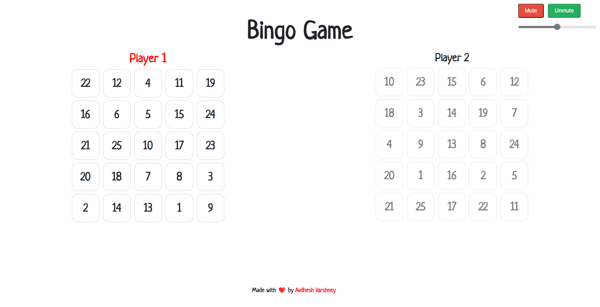

<h1 align='center'>💥 Bingo Game 💥</h1>

### :zap: **TECH STACK USED** 

  
  
  

### :zap: **[Play Game 🎮](https://gamebingo.netlify.app/)**

## :zap: **FUNCTIONALITIES 🎮** 

- 🕹️ Shuffling of 25 numbers 🎮
- 🎮 Initializing scores at start of the game and score calculation after every "hit" 🕹️
- 🕹️ Comparing and checking letters of "B I N G O" on each and every clicked 🎮
- 🎮 At the end of the game, declaring, either winner of the game or draw of the game 🕹️
- 🕹️ Also adding background sound in the background of the game, while playing 🎮
- 🎮 Providing support for the multi-players upto 10 🕹️

## :zap: **SCREENSHOTS 📸**

## :zap: **HOW TO PLAY? 🕹️**

- The game will start by asking number of players are playing this game.
- According to that boards are created and background song starts.
- On every click on the numbers, that number will not re-accessible for any player.
- On completion of all letters of "B I N G O", announcement will occur at the end.
- How final outcomes are decided?
    - Who first completed their "B I N G O" letters.

## **WORKING VIDEO 📹**

https://github.com/Avdhesh-Varshney/Bingo-Game/assets/114330097/e06cb0f3-8b6e-46bf-8344-d992e5a4bc09

  <h3>Show some &nbsp;❤️&nbsp; by &nbsp;🌟&nbsp; this repository!</h3>

